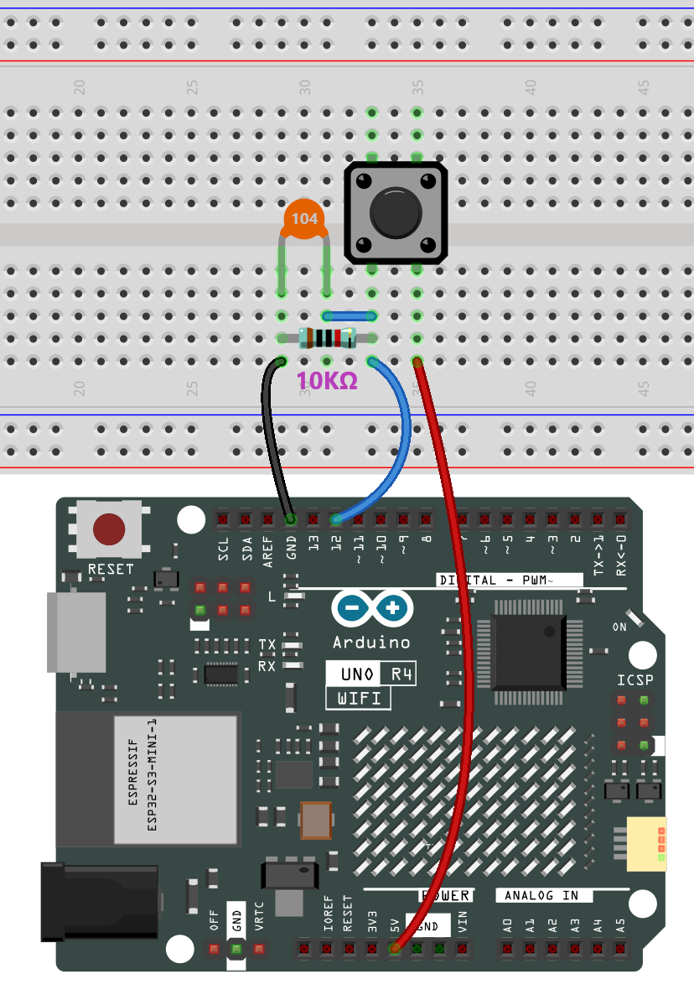

# Button

## Overview

In this lesson, you will learn about controlling an LED using a button with Arduino. Buttons and LEDs are fundamental components in a wide range of electronic devices, such as remote controls, flashlights, and interactive installations. In this setup, a button is used as an input device to control the state of an LED, which serves as an output device.

The button is connected to pin 12 on the Arduino Uno R4 board, and the LED is connected to pin 13. When the button is pressed, a signal is sent to the Arduino, triggering the LED to turn on. Conversely, when the button is released, the LED turns off. This simple yet effective mechanism can be the basis for more complex projects, such as home automation systems, interactive displays, and much more.

By the end of this lesson, you will understand how to read input from a button and use it to control an LED, thereby gaining a foundational understanding of input/output operations with Arduino.

## Wiring

Connect one end of the buttons to pin 12 which connects with a pull-down resistor and a 0.1uF (104) capacitor (to eliminate jitter and output a stable level when the button is working). Connect the other end of the resistor to GND and one of the pins at the other end of the button to 5V. When the button is pressed, pin 12 is 5V (HIGH) and set pin 13 (integrated with an LED) as High at the same time. Then release the button (pin 12 changes to LOW) and pin 13 is Low. So we will see the LED lights up and goes out alternately as the button is pressed and released.

## Code

> **Note:**
>
> * You can open the file `10-led.ino` under the path of `Basic-Starter-Kit-for-Arduino-Uno-R4-WiFi-main\10-led`.

## Code Analysis

This Arduino code is designed to control an LED using a button. When the button is pressed, the LED turns on, and when the button is released, the LED turns off. The code is written for an Arduino Uno R4 board.

1. **Pin Definitions** :
   * `buttonPin` is set to 12, which is the pin number connected to the button.
   * `ledPin` is set to 13, which is the pin number connected to the LED.
2. **Variable Initialization** :
   * `buttonState` is initialized to 0, which will be used to store the current state of the button.
3. **Setup Function** :
   * `pinMode(buttonPin, INPUT)`: Configures the button pin as an input, which allows the program to read the button's state.
   * `pinMode(ledPin, OUTPUT)`: Configures the LED pin as an output, which allows the program to control the LED.
4. **Loop Function** :
   * The `loop` function runs repeatedly.
   * `buttonState = digitalRead(buttonPin)`: Reads the current state of the button (either HIGH or LOW) and stores it in `buttonState`.
   * `if (buttonState == HIGH)`: Checks if the button is pressed. If it is, the LED is turned on (`digitalWrite(ledPin, HIGH)`).
   * `else`: If the button is not pressed, the LED is turned off (`digitalWrite(ledPin, LOW)`).

This simple program effectively toggles the LED based on the button's state, demonstrating basic digital input and output operations with the Arduino.
