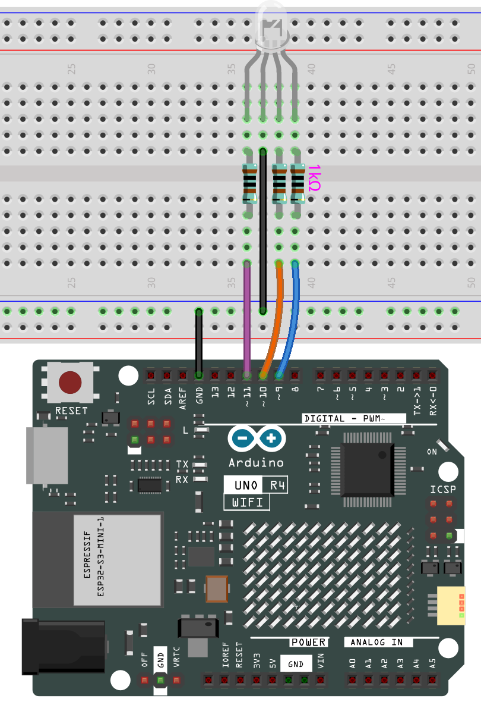

# RGB LED

## Overview

In this lesson, we will use PWM to control an RGB LED to flash various kinds of color. When different PWM values are set to the R, G, and B pins of the LED, its brightness will be different. When the three different colors are mixed, we can see that the RGB LED flashes different colors.

## PWM

Pulse width modulation, or PWM, is a technique for getting analog results with digital means. Digital control is used to create a square wave, a signal switched between on and off. This on-off pattern can simulate voltages in between full on (5 Volts) and off (0 Volts) by changing the portion of the time the signal spends on versus the time that the signal spends off. The duration of “on time” is called pulse width. To get varying analog values, you change, or modulate, that width. If you repeat this on-off pattern fast enough with some device, an LED for example, it would be like this: the signal is a steady voltage between 0 and 5V controlling the brightness of the LED. (See the PWM description on the official website of Arduino).

In the graphic below, the green lines represent a regular time period. This duration or period is the inverse of the PWM frequency. In other words, with Arduino’s PWM frequency at about 500Hz, the green lines would measure 2 milliseconds each.

A call to analogWrite() is on a scale of 0 - 255, such that analogWrite(255) requests a 100% duty cycle (always on), and analogWrite(127) is a 50% duty cycle (on half the time) for example.

You will find that the smaller the PWM value is, the smaller the value will be after being converted into voltage. Then the LED becomes dimmer accordingly. Therefore, we can control the brightness of the LED by controlling the PWM value.

## Wiring



## Code

> **Note:**
>
> * You can open the file `11-rgb_led.ino` under the path of `elite-explorer-kit-main\basic_project\10-led`.

Once the code is successfully uploaded, you will observe the RGB LED flashing in a circular pattern of red, green, and blue initially. It will then proceed to flash in the sequence of red, orange, yellow, green, blue, indigo, and purple.

## Code Analysis

### Set the color

Here use the `color()` function to set the color of the RGB LED. In the code, it is set to flash 7 different colors.

You can use the paint tool on your computer to get the RGB value.

1. Open the paint tool on your computer and click to Edit colors.
   
2. Select one color, then you can see the RGB value of this color. Fill them in the code.

   > **Note:**
   >
   > Due to hardware and environmental factors, the colors displayed on computer screens and RGB LEDs may vary even when using the same RGB values
   >

   

### Pin Definitions

```cpp
const int redPin = 11;     // Red pin connected to digital pin 11
const int greenPin = 10;   // Green pin connected to digital pin 10
const int bluePin = 9;     // Blue pin connected to digital pin 9
```

- **Explanation**: These lines define the pin numbers for the red, green, and blue components of the RGB LED. The constants `redPin`, `greenPin`, and `bluePin` are assigned to digital pins 11, 10, and 9 respectively.
- **Importance**: Setting these constants allows the program to easily reference and control the specific pins connected to the RGB LED.

### Setup Function

```cpp
void setup() { 
  pinMode(redPin, OUTPUT);   
  pinMode(greenPin, OUTPUT); 
  pinMode(bluePin, OUTPUT);  
}  
```

- **Explanation**: The `setup()` function initializes the RGB LED pins as outputs using the `pinMode()` function.
  - `pinMode(redPin, OUTPUT)` sets the red pin as an output.
  - `pinMode(greenPin, OUTPUT)` sets the green pin as an output.
  - `pinMode(bluePin, OUTPUT)` sets the blue pin as an output.
- **Importance**: This setup is necessary for the Arduino to control the LED. Without setting the pins as outputs, the `analogWrite()` function would not function correctly.

### Main Loop Function

```cpp
void loop() {  
  color(255, 0, 0);  // Red
  delay(1000);       // Wait for 1 second
  color(0, 255, 0);  // Green
  delay(1000);       // Wait for 1 second
  color(0, 0, 255);  // Blue
  delay(1000);       // Wait for 1 second

  color(255, 0, 252);  // Magenta
  delay(1000);         // Wait for 1 second
  color(237, 109, 0);  // Orange
  delay(1000);         // Wait for 1 second
  color(255, 215, 0);  // Yellow
  delay(1000);         // Wait for 1 second
  color(34, 139, 34);  // Forest Green
  delay(1000);         // Wait for 1 second
  color(0, 112, 255);  // Light Blue
  delay(1000);         // Wait for 1 second
  color(0, 46, 90);    // Indigo
  delay(1000);         // Wait for 1 second
  color(128, 0, 128);  // Purple
  delay(1000);         // Wait for 1 second
}   
```

- **Explanation**: The `loop()` function continuously cycles through a series of colors by calling the `color()` function with different RGB values, and then waits for one second (`delay(1000)`) between each color change.
  - For example, `color(255, 0, 0); delay(1000);` sets the LED to red and waits for one second.
- **Importance**: This function allows the RGB LED to display a sequence of colors, providing a visual effect. The delay ensures each color is visible for a sufficient amount of time.

### Color Function

```cpp
void color(int red, int green, int blue) {  
  analogWrite(redPin, red);   
  analogWrite(greenPin, green); 
  analogWrite(bluePin, blue); 
}
```

- **Explanation**: The `color()` function sets the intensity of the red, green, and blue components of the RGB LED.
  - `analogWrite(redPin, red)` sets the brightness of the red LED.
  - `analogWrite(greenPin, green)` sets the brightness of the green LED.
  - `analogWrite(bluePin, blue)` sets the brightness of the blue LED.
- **Importance**: This function allows for precise control over the color displayed by the RGB LED by adjusting the PWM (Pulse Width Modulation) values sent to each color component.

### analogWrite()

```cpp
analogWrite(redPin, red);
analogWrite(greenPin, green);
analogWrite(bluePin, blue);
```

- **Explanation**: `analogWrite()` writes an analog value (PWM wave) to a pin. It adjusts the duty cycle of the PWM signal to control the brightness of the LED.
- **Importance**: This function is crucial for controlling
